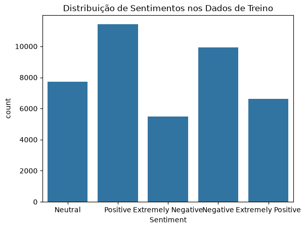

# Classificação de Sentimentos em Tweets sobre COVID-19 (PLN)

Projeto de Processamento de Linguagem Natural que classifica o sentimento de tweets sobre COVID-19 em **5 classes** (Extremely Negative, Negative, Neutral, Positive, Extremely Positive) com **TF-IDF + Random Forest**.

## Dados

Base pública *Coronavirus Tweets NLP* (Kaggle): **41.157 tweets de treino** e **3.798 de teste**, já rotulados por sentimento.



## Fluxo

1. **Pré-processamento com NLTK:** minúsculas, remoção de pontuação e de stopwords, lematização.
2. **Vetorização com TF-IDF:** o texto vira uma matriz numérica, ajustada só no treino.
3. **Divisão:** 80% treino e 20% validação, dentro da base de treino.
4. **Modelo:** `RandomForestClassifier` (scikit-learn).
5. **Avaliação:** relatório de precisão, recall e F1 na validação e no conjunto de teste separado.

## Resultados (conjunto de teste, 3.798 tweets)

| Métrica | Valor |
|---|---|
| Acurácia | **0,46** |
| F1 macro | 0,45 |
| Referência: chutar sempre a classe mais comum (Negative) | 0,27 de acurácia |

| Classe | Precisão | Recall | F1 |
|---|---|---|---|
| Extremely Negative | 0,60 | 0,27 | 0,37 |
| Negative | 0,44 | 0,41 | 0,42 |
| Neutral | 0,47 | 0,72 | 0,57 |
| Positive | 0,39 | 0,56 | 0,46 |
| Extremely Positive | 0,66 | 0,29 | 0,40 |

**Leitura dos resultados:**
- O modelo é bem melhor que o chute (0,46 contra 0,27), mas ainda confunde classes vizinhas: *Extremely Negative* com *Negative* e *Extremely Positive* com *Positive*. Nas classes extremas, o recall fica abaixo de 0,30.
- Na validação a acurácia foi 0,53, e no teste caiu para 0,46. A queda indica que o modelo generaliza pior para os tweets do conjunto de teste do que para a validação tirada da própria base de treino.

## Próximos passos

- Testar modelos lineares (Regressão Logística, SVM linear), que costumam ir melhor com TF-IDF, e usar bigramas.
- Avaliar a versão com 3 classes (negativo, neutro e positivo), juntando as extremas.
- Comparar com um modelo pré-treinado de linguagem (por exemplo, BERT).

## Como executar

```bash
pip install -r requirements.txt
python "Classificação de texto.py"
```

O script lê os CSVs da própria pasta, baixa os recursos do NLTK (stopwords e wordnet), imprime os relatórios e salva o gráfico de distribuição. Leva alguns minutos, por causa do Random Forest com milhares de atributos TF-IDF.

## Tecnologias

Python, Pandas, scikit-learn, NLTK, Seaborn, Matplotlib.
